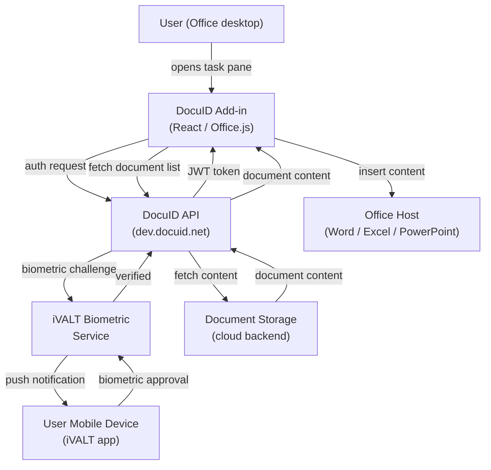
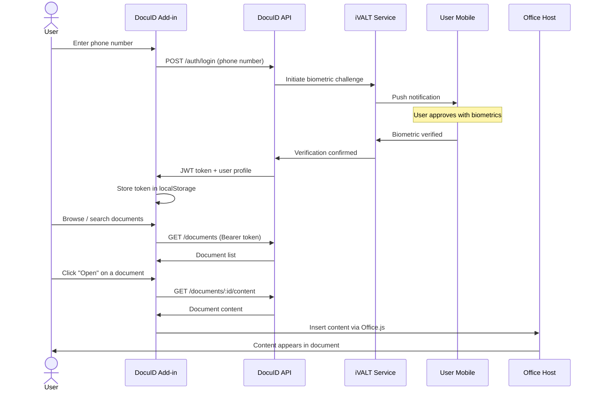
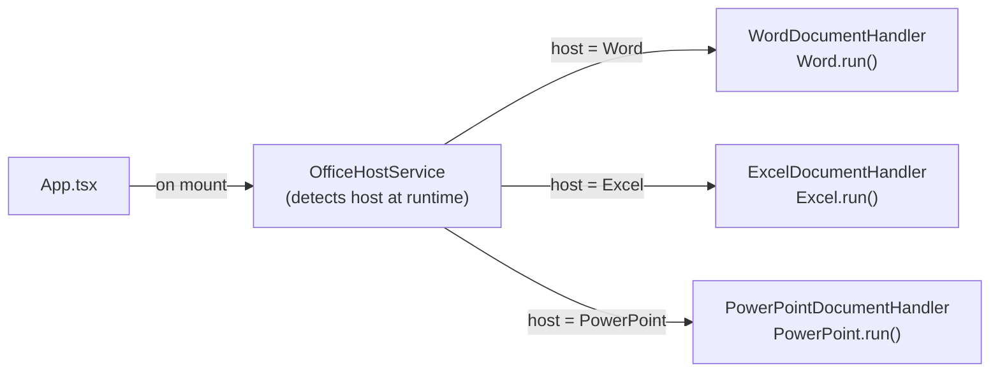

# DocuID Office Add-in

A Microsoft Office Add-in that enables secure biometric authentication and document access through the iVALT DocuID system. Supports Word, Excel, and PowerPoint.

**Live on Microsoft AppSource**: [iVALT DocuID on Microsoft AppSource](https://marketplace.microsoft.com/en-us/product/wa200010668?tab=overview)

---

## Features

- Biometric authentication via phone number and iVALT verification
- Document browsing, search, and insertion
- Multi-host support: Word, Excel, and PowerPoint
- Real API integration with docuid.net and iVALT backends
- Structured debug logging with in-app debug panel

---

## How It Works

### System Architecture



### Authentication and Document Flow



### Multi-Host Routing



---

## Prerequisites

- [Bun](https://bun.sh/) (enforced; npm/pnpm/yarn are blocked)
- Microsoft 365 (Word, Excel, or PowerPoint desktop)
- Node.js LTS (for tooling compatibility)
- iVALT DocuID account for authentication testing

---

## Local Development

### 1. Install dependencies

```bash
bun install
```

### 2. Generate HTTPS certificates

Office Add-ins require HTTPS even in development. The dev server uses self-signed certificates via `office-addin-dev-certs`, which are generated automatically when the dev server starts.

If you hit certificate trust errors, run:

```bash
npx office-addin-dev-certs install
```

### 3. Start the dev server

```bash
bun run dev-server
```

This starts a webpack HTTPS dev server on `https://localhost:3000`. Keep this running in a separate terminal while sideloading.

### 4. Sideload into an Office application

Open a second terminal and run one of:

```bash
bun run dev           # Word (default)
bun run dev:word      # Word
bun run dev:excel     # Excel
bun run dev:powerpoint  # PowerPoint
```

This loads `manifests/manifest-dev.xml` (or the Excel/PowerPoint dev variant), which points to `https://localhost:3000`. The ribbon button will display "(DEV)" to confirm local code is active.

### 5. Stop sideloading

```bash
bun run dev:stop:word
bun run dev:stop:excel
bun run dev:stop:powerpoint
```

---

## Testing Against Production

To run the add-in pointing at the live deployed build (`https://addon.docuid.net`) without a local server:

```bash
bun run start:word
bun run start:excel
bun run start:powerpoint
```

Stop with:

```bash
bun run stop:word
bun run stop:excel
bun run stop:powerpoint
```

---

## Build

```bash
bun run build        # Production build (webpack)
bun run build:dev    # Development build (webpack)
bun run watch        # Webpack watch mode
bun run vercel-build # CI production build (used by Vercel)
```

Output goes to `dist/`.

---

## Code Quality

```bash
bun run lint         # Biome linter (check only)
bun run lint:fix     # Biome linter with auto-fix
bun run format       # Format all files with Biome
bun run format:check # Check formatting without writing
```

Biome replaces ESLint and Prettier in this project.

---

## Manifest Validation

```bash
bun run validate:word          # manifests/manifest.xml
bun run validate:excel         # manifests/manifest-excel.xml
bun run validate:powerpoint    # manifests/manifest-powerpoint.xml
bun run validate:prod          # manifests/manifest-production.xml (installer)
bun run validate:dev           # manifests/manifest-dev.xml
bun run validate:dev:excel     # manifests/manifest-excel-dev.xml
bun run validate:dev:powerpoint  # manifests/manifest-powerpoint-dev.xml
```

---

## Account Management

```bash
bun run signin   # Sign in to M365 account for testing
bun run signout  # Sign out of M365 account
```

---

## Windows Installer

```bash
bun run installer:build    # Build installer via PowerShell
bun run installer:package  # Validate prod manifest then build installer
```

---

## Dev vs Production Comparison

| Aspect       | Dev (`dev:*` scripts)              | Prod (`start:*` scripts)            |
|--------------|------------------------------------|-------------------------------------|
| Manifest     | `manifests/*-dev.xml`              | `manifests/manifest*.xml`           |
| Source URL   | `https://localhost:3000`           | `https://addon.docuid.net`          |
| Code served  | Webpack dev server (hot reload)    | Vercel-deployed static build        |
| Ribbon label | "iVALT DocuID (DEV)"              | "iVALT DocuID"                      |

---

## Project Structure

```
manifests/                           # All Office Add-in XML manifests
  manifest.xml                       # Word (production)
  manifest-excel.xml                 # Excel (production)
  manifest-powerpoint.xml            # PowerPoint (production)
  manifest-production.xml            # Used for installer packaging
  manifest-dev.xml                   # Word (dev -> localhost:3000)
  manifest-excel-dev.xml             # Excel (dev -> localhost:3000)
  manifest-powerpoint-dev.xml        # PowerPoint (dev -> localhost:3000)

src/
  taskpane/                          # Main React application
    App.tsx                          # Root component, auth state, host routing
    components/                      # React UI components
      Header.tsx
      LoginForm.tsx
      DocumentList.tsx
      ShareSidebar.tsx
      ShareSuccessModal.tsx
      DownloadSheet.tsx
      DebugPanel.tsx
      AppDownloadButtons.tsx
      profile/                       # Profile page components
      shared/                        # Reusable primitives (Button, Card, etc.)
    services/                        # Business logic and API layer
      AuthService.ts                 # Auth state, token management, localStorage
      DocuIdApiService.ts            # REST API calls to docuid.net
      DocumentService.ts             # Document fetch and management
      OfficeHostService.ts           # Detects current Office host at runtime
      WordDocumentHandler.ts         # Word.run() insertion logic
      ExcelDocumentHandler.ts        # Excel.run() insertion logic
      PowerPointDocumentHandler.ts   # PowerPoint.run() insertion logic
      Logger.ts                      # Structured logging utility
  commands/                          # Office ribbon command handlers

assets/                              # Static assets and icons
installer/                           # Windows installer scripts
manifests/                           # XML manifests (see above)
docs/                                # Additional documentation
```

---

## Architecture

### Multi-Host Support

The add-in runs in Word, Excel, and PowerPoint via a shared `IDocumentHandler` interface. `OfficeHostService` detects the current host at runtime, and `App.tsx` instantiates the correct handler:

- `WordDocumentHandler` — `Word.run()` with paragraph and content control insertion
- `ExcelDocumentHandler` — `Excel.run()` with range and cell operations
- `PowerPointDocumentHandler` — `PowerPoint.run()` with slide shape insertion

### Authentication Flow

1. User enters their registered phone number with country code
2. iVALT biometric verification is triggered on the user's mobile device
3. `AuthService` receives and stores the JWT token in localStorage with expiration tracking
4. All subsequent API requests send `Authorization: Bearer <token>`

### State Management

- React hooks (`useState`, `useEffect`) only — no external state library
- Authentication state lives in `App.tsx`, hydrated from `AuthService` on mount

---

## Debug Panel

The add-in includes a built-in debug panel for development and troubleshooting.

**Toggle**: Press `Ctrl+Shift+D` or click the bug icon in the header.

Features:
- Real-time structured logs with timestamps, contexts, and data payloads
- Filter by log level (DEBUG, INFO, WARN, ERROR) or context name
- Toggle console output on/off
- Export logs as JSON

### Log Contexts

| Context                   | Description                                       |
|---------------------------|---------------------------------------------------|
| `AuthService`             | Login attempts, token management                  |
| `AuthService.API`         | API request/response times and HTTP status        |
| `AuthService.Poll`        | Biometric polling attempts, timeouts, results     |
| `AuthService.Storage`     | Token storage and expiration checks               |
| `DocumentService`         | Document fetch, open/close actions                |
| `DocumentService.Office`  | Office.js API calls and results                   |
| `App`                     | Component lifecycle and state changes             |

### Browser Console Control

```javascript
// Set log level: 0=DEBUG, 1=INFO, 2=WARN, 3=ERROR
localStorage.setItem("docuid_log_level", "0");

// Disable console output
localStorage.setItem("docuid_console_logging", "false");

// Reset to defaults
localStorage.removeItem("docuid_log_level");
localStorage.removeItem("docuid_console_logging");
```

---

## Troubleshooting

**Add-in not loading**
- Confirm the dev server is running on `https://localhost:3000`
- Verify HTTPS certificates are trusted: run `npx office-addin-dev-certs install`
- Check that the correct dev manifest is sideloaded

**Authentication fails**
- Open the debug panel and review `AuthService` and `AuthService.API` logs
- Confirm the phone number is registered in the DocuID system
- Check network access to `dev.docuid.net`

**Document insertion fails**
- Review `DocumentService.Office` logs for Office.js errors
- Confirm the Office host matches the loaded manifest (e.g., do not load the Word manifest in Excel)
- Verify the user has document access in DocuID

---

## Security

- HTTPS is required by the Office Add-in platform; self-signed certs used in development
- JWT tokens are stored in localStorage with expiration; cleared on logout
- Input is validated before all API calls
- CORS is configured for `docuid.net` and `addon.docuid.net`

---

## Supported Platforms

- Windows: Microsoft 365, Office 2019+
- macOS: Microsoft 365, Office 2019+
- Hosts: Word, Excel, PowerPoint (desktop)

---

## Contributing

1. Branch from `working`
2. Follow existing TypeScript and React patterns (functional components, hooks only)
3. Run `bun run lint && bun run format:check` before committing
4. Test on both Windows and macOS where possible
5. Submit a PR with a clear description of changes

---

## Deployment

Production builds are deployed to Vercel. The `vercel.json` at the repo root configures the build. Vercel runs `bun run vercel-build` (alias for `bun run build`) on each push.

Manifests in `manifests/manifest*.xml` (non-dev variants) reference `https://addon.docuid.net` and require no changes for production.

For the Windows installer: `bun run installer:package` validates the production manifest then runs the PowerShell build script.

---

## Documentation

| Document | Description |
|----------|-------------|
| [Overview](docs/00-overview/OVERVIEW.md) | Project introduction and documentation structure |
| [PRD](docs/01-planning/PRD.md) | Product requirements, feature scope, and milestones |
| [Architecture](docs/02-technical/ARCHITECTURE.md) | Technical architecture deep-dive |
| [API Documentation](docs/02-technical/API_DOCUMENTATION.md) | DocuID REST API endpoints and usage |
| [Security](docs/02-technical/SECURITY.md) | Security model, token handling, and threat considerations |
| [Design System](docs/02-technical/DESIGN_SYSTEM.md) | UI component and styling guide |
| [Development Guide](docs/03-development/DEVELOPMENT_GUIDE.md) | Full local dev setup, patterns, and workflow |
| [Testing Guide](docs/03-development/TESTING_GUIDE.md) | Manual testing procedures for all features |
| [Deployment Guide](docs/03-development/DEPLOYMENT_GUIDE.md) | Vercel deployment, manifests, and release process |
| [AppSource Submission](docs/03-development/APPSTORE_SUBMISSION.md) | Submitting updates to Microsoft AppSource |
| [Vercel Deployment](docs/03-development/VERCEL_DEPLOYMENT.md) | Vercel-specific configuration reference |
| [Windows Distribution](docs/03-development/WINDOWS_EXECUTABLE_DISTRIBUTION.md) | Building and distributing the Windows installer |
| [Operations Guide](docs/05-operations/OPERATIONS_GUIDE.md) | Monitoring, logging, and production maintenance |
| [User Guide](docs/06-user/USER_GUIDE.md) | End-user documentation |
