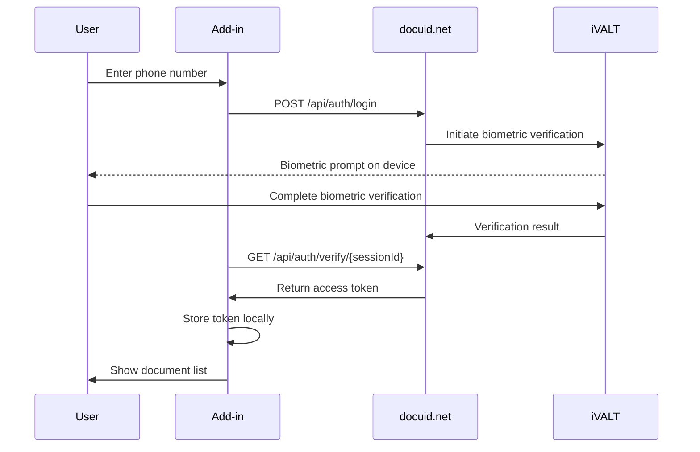
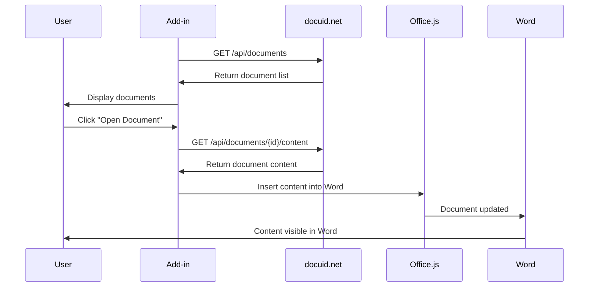

# DocuID System Architecture

## Overview

DocuID is a Microsoft Office Add-in that provides secure biometric authentication and document management capabilities through integration with the iVALT biometric system and docuid.net backend services.

## Architecture Diagram


## High-Level Architecture

### Components

```
┌─────────────────────────────────────────────────────────────┐
│                    Microsoft Office                         │
│  ┌─────────────────────────────────────────────────────┐    │
│  │              DocuID Add-in                          │    │
│  │  ┌─────────────┐  ┌─────────────┐  ┌─────────────┐  │    │
│  │  │   React UI  │  │ AuthService │  │ DocService  │  │    │
│  │  └─────────────┘  └─────────────┘  └─────────────┘  │    │
│  │  ┌─────────────────────────────────────────────┐    │    │
│  │  │           Office.js API Layer               │    │    │
│  │  └─────────────────────────────────────────────┘    │    │
│  └─────────────────────────────────────────────────────┘    │
└─────────────────────────────────────────────────────────────┘
                              │
                              │ HTTPS API Calls
                              ▼
┌─────────────────────────────────────────────────────────────┐
│                     docuid.net Backend                      │
│  ┌─────────────────┐  ┌─────────────────┐                   │
│  │  Authentication │  │  Document APIs  │                   │
│  │     Service     │  │                 │                   │
│  └─────────────────┘  └─────────────────┘                   │
│              │                   │                          │
│              ▼                   ▼                          │
│  ┌─────────────────┐  ┌─────────────────┐                   │
│  │  iVALT Biometric│  │  Document Store │                   │
│  │    Integration  │  │   (AWS S3/etc)  │                   │
│  └─────────────────┘  └─────────────────┘                   │
└─────────────────────────────────────────────────────────────┘
```

## Frontend Architecture

### Technology Stack
- **Framework**: React 19 with TypeScript
- **Build System**: Webpack 5 with Babel transpilation
- **Target**: ES5 for Office compatibility
- **Styling**: CSS modules with responsive design
- **Office Integration**: Office.js API

### Component Architecture

```
App.tsx (Root Component)
├── Header.tsx
│   ├── User info display
│   └── Logout functionality
├── LoginForm.tsx
│   ├── Phone number input
│   ├── Validation
│   └── Authentication trigger
└── DocumentList.tsx
    ├── Document search/filter
    ├── Document metadata display
    └── Document actions (Open/Download)
```

### Service Layer

```
Services/
├── AuthService.ts
│   ├── Login/logout functionality
│   ├── Session management
│   ├── Token storage (localStorage)
│   └── Mock authentication for development
└── DocumentService.ts
    ├── Document listing
    ├── Document content retrieval
    ├── Office.js integration
    └── Mock data for development
```

## Backend Architecture

### docuid.net API Structure

```
API Endpoints:
├── /api/auth/
│   ├── POST /login          # Initiate biometric auth
│   ├── GET /verify/{id}     # Check auth status
│   ├── POST /refresh        # Refresh tokens
│   └── POST /logout         # Invalidate session
└── /api/documents/
    ├── GET /                # List user documents
    ├── GET /{id}           # Get document details
    ├── GET /{id}/content   # Get document content
    ├── GET /{id}/download  # Download document
    └── POST /search        # Search documents
```

### Authentication Flow



### Document Management Flow



## Security Architecture

### Authentication Security
- **JWT Tokens**: Bearer token authentication
- **Token Expiration**: 24-hour session timeout
- **Secure Storage**: localStorage with expiration checks
- **HTTPS Only**: All communications encrypted

### Document Security
- **Access Control**: User-specific document authorization
- **Session Validation**: Token required for all document operations
- **Audit Trail**: Document access logging
- **Content Protection**: No local caching of sensitive content

### Office Add-in Security
- **Manifest Permissions**: ReadWriteDocument scope
- **HTTPS Requirement**: Secure hosting mandatory
- **CORS Configuration**: Restricted to Office domains
- **Content Security Policy**: XSS protection

## Development vs Production

### Development Environment
```
Development Mode:
├── Mock Authentication (AuthService)
├── Mock Document Data (DocumentService)
├── localhost:3000 with self-signed certs
├── Hot reload with webpack-dev-server
└── Debug logging enabled
```

### Production Environment
```
Production Mode:
├── Real docuid.net API integration
├── Production HTTPS hosting
├── Optimized webpack bundle
├── Error tracking/monitoring
└── Performance optimization
```

## Data Flow

### State Management
```
App State Flow:
├── Authentication State
│   ├── isAuthenticated: boolean
│   ├── user: UserInfo | null
│   └── sessionToken: string | null
├── Document State
│   ├── documents: Document[]
│   ├── selectedDocument: Document | null
│   └── searchQuery: string
└── UI State
    ├── isLoading: boolean
    ├── error: string | null
    └── activeView: 'login' | 'documents'
```

### Data Persistence
```
Storage Strategy:
├── SessionStorage
│   └── Temporary UI state
├── LocalStorage
│   ├── Authentication tokens
│   ├── User preferences
│   └── Session expiration
└── Memory Only
    ├── Document content
    ├── Search results
    └── Temporary data
```

## Performance Considerations

### Bundle Optimization
- **Code Splitting**: Lazy loading for non-critical components
- **Tree Shaking**: Unused code elimination
- **Minification**: Production bundle compression
- **Asset Optimization**: Image and resource optimization

### Runtime Performance
- **Lazy Loading**: Documents loaded on demand
- **Caching Strategy**: API response caching
- **Debounced Search**: Reduced API calls for search
- **Efficient Rendering**: React optimization patterns

### Office.js Performance
- **Context Batching**: Batch Office.js operations
- **Minimal DOM Updates**: Efficient Word document updates
- **Memory Management**: Proper cleanup of Office objects
- **Error Handling**: Graceful fallbacks for API failures

## Scalability Considerations

### Frontend Scalability
- **Component Reusability**: Modular component design
- **Service Abstraction**: Clean API abstraction layer
- **Error Boundaries**: Isolated error handling
- **Responsive Design**: Multiple screen size support

### Backend Integration
- **API Rate Limiting**: Respect backend rate limits
- **Retry Logic**: Automatic retry for failed requests
- **Bulk Operations**: Efficient batch document operations
- **Pagination**: Large document list handling

## Monitoring and Debugging

### Development Debugging
- **Console Logging**: Structured logging with levels
- **React DevTools**: Component state inspection
- **Network Tab**: API call monitoring
- **Office.js Debugging**: Office platform debugging tools

### Production Monitoring
- **Error Tracking**: Centralized error reporting
- **Performance Metrics**: Load time and response monitoring
- **Usage Analytics**: User interaction tracking
- **Health Checks**: System availability monitoring

## Deployment Architecture

### Development Deployment
```
Local Development:
├── webpack-dev-server (port 3000)
├── Self-signed SSL certificates
├── Hot module replacement
└── Live reload capability
```

### Production Deployment
```
Production Hosting:
├── HTTPS hosting (required for Office Add-ins)
├── CDN for static assets
├── Load balancing capability
├── SSL certificate management
└── Domain configuration
```

## Integration Points

### Office.js Integration
- **Word API**: Document content manipulation
- **Authentication**: Office 365 context
- **Ribbon Integration**: Custom ribbon buttons
- **Task Pane**: Persistent side panel

### Backend Integration
- **docuid.net**: Primary API for auth and documents
- **iVALT**: Biometric verification system
- **Cloud Storage**: Document storage backend
- **Monitoring**: Logging and analytics systems

---

*This architecture supports the current Phase 1 implementation and provides a foundation for future phases and enhancements.*