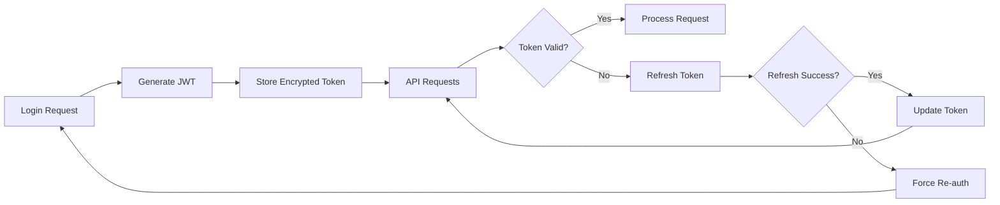

# DocuID Security Documentation

## Overview

This document outlines the security architecture, considerations, and implementation details for the DocuID Office Add-in. Security is paramount given the sensitive nature of biometric authentication and document access.

## Security Architecture

### Defense in Depth Strategy

```
┌─────────────────────────────────────────────────┐
│               Client Security                   │
│  ┌─────────────────────────────────────────┐    │
│  │        Office Add-in Security           │    │
│  │  • HTTPS Only                           │    │
│  │  • CSP Headers                          │    │
│  │  • Input Validation                     │    │
│  │  • XSS Protection                       │    │
│  │  • Token Security                       │    │
│  └─────────────────────────────────────────┘    │
└─────────────────────────────────────────────────┘
                      │
                      │ Encrypted Transport
                      ▼
┌─────────────────────────────────────────────────┐
│              Network Security                   │
│  • TLS 1.3 Encryption                          │
│  • Certificate Pinning                         │
│  • CORS Policy                                 │
│  • Rate Limiting                               │
└─────────────────────────────────────────────────┘
                      │
                      ▼
┌─────────────────────────────────────────────────┐
│             Backend Security                    │
│  ┌─────────────────────────────────────────┐    │
│  │           docuid.net API                │    │
│  │  • JWT Authentication                   │    │
│  │  • API Rate Limiting                    │    │
│  │  • Input Sanitization                  │    │
│  │  • Audit Logging                       │    │
│  └─────────────────────────────────────────┘    │
│  ┌─────────────────────────────────────────┐    │
│  │          iVALT Integration              │    │
│  │  • Biometric Verification              │    │
│  │  • Multi-factor Authentication         │    │
│  │  • Device Registration                 │    │
│  └─────────────────────────────────────────┘    │
└─────────────────────────────────────────────────┘
```

## Authentication Security

### Biometric Authentication Flow

1. **Phone Number Verification**
   - Format validation (E.164 international format)
   - Rate limiting on authentication attempts
   - No storage of sensitive biometric data in add-in

2. **iVALT Integration Security**
   - Secure API communication with iVALT service
   - Biometric templates never transmitted to add-in
   - Multi-factor authentication combining phone + biometrics
   - Session-based verification with time limits

3. **Session Management**
   ```typescript
   interface SecureSession {
     sessionToken: string; // JWT token
     expiresAt: number; // Unix timestamp
     refreshToken: string; // Refresh capability
     userId: string; // User identifier
     permissions: string[]; // Access permissions
   }
   ```

### Token Security

#### JWT Token Structure

```json
{
  "header": {
    "alg": "HS256",
    "typ": "JWT"
  },
  "payload": {
    "sub": "user_id",
    "iat": 1640995200,
    "exp": 1641081600,
    "permissions": ["read_documents", "download_documents"],
    "session_id": "sess_abc123"
  }
}
```

#### Token Storage Security

- **Storage Location**: localStorage (development), secure storage (production)
- **Encryption**: Tokens encrypted at rest in production
- **Expiration**: Automatic cleanup of expired tokens
- **Validation**: Server-side token validation on each request

#### Token Lifecycle



## Data Protection

### Document Security

#### Access Control

- **User Authorization**: Document access based on user permissions
- **Session Validation**: Active session required for all document operations
- **Audit Trail**: All document access logged with timestamps
- **Content Protection**: No local caching of sensitive document content

#### Data Classification

```typescript
enum DocumentSecurityLevel {
  PUBLIC = "public",
  INTERNAL = "internal",
  CONFIDENTIAL = "confidential",
  RESTRICTED = "restricted",
}

interface SecureDocument {
  id: string;
  securityLevel: DocumentSecurityLevel;
  accessPermissions: Permission[];
  encryptionKey?: string;
  watermark?: WatermarkConfig;
}
```

### Data in Transit

- **Encryption**: TLS 1.3 for all communications
- **Certificate Validation**: Strict certificate validation
- **Header Security**: Security headers for all requests
- **Payload Integrity**: Request/response integrity checks

### Data at Rest

- **Local Storage**: Minimal sensitive data storage
- **Token Encryption**: Encrypted storage of authentication tokens
- **No Document Caching**: Documents not persisted locally
- **Secure Cleanup**: Automatic cleanup of temporary data

## Office Add-in Security

### Manifest Security

```xml
<Permissions>ReadWriteDocument</Permissions>
<Requirements>
  <Sets DefaultMinVersion="1.3">
    <Set Name="WordApi" MinVersion="1.3"/>
  </Sets>
</Requirements>
```

### Content Security Policy

```html
<meta
  http-equiv="Content-Security-Policy"
  content="
        default-src 'self' https://dev.docuid.net;
        script-src 'self' 'unsafe-inline' https://appsforoffice.microsoft.com;
        style-src 'self' 'unsafe-inline';
        img-src 'self' data: https:;
        connect-src 'self' https://dev.docuid.net;
        frame-ancestors https://office.com https://*.office.com;
      "
/>
```

### Domain Security

- **HTTPS Only**: All resources served over HTTPS
- **CORS Configuration**: Restricted to Office domains
- **Domain Validation**: Manifest domain restrictions
- **Subdomain Control**: Prevent subdomain takeover

## Input Validation & Sanitization

### Phone Number Validation

```typescript
class PhoneValidator {
  static validate(phoneNumber: string): boolean {
    // E.164 format validation
    const e164Regex = /^\+[1-9]\d{1,14}$/;

    // Length validation (6-15 digits plus country code)
    if (phoneNumber.length < 7 || phoneNumber.length > 16) {
      return false;
    }

    // Format validation
    return e164Regex.test(phoneNumber);
  }

  static sanitize(phoneNumber: string): string {
    // Remove non-numeric characters except +
    return phoneNumber.replace(/[^\d+]/g, "");
  }
}
```

### Document Content Sanitization

```typescript
class ContentSanitizer {
  static sanitizeForOffice(content: string): string {
    // Remove potentially dangerous HTML/script content
    const cleanContent = content
      .replace(/<script\b[^<]*(?:(?!<\/script>)<[^<]*)*<\/script>/gi, "")
      .replace(/<iframe\b[^<]*(?:(?!<\/iframe>)<[^<]*)*<\/iframe>/gi, "")
      .replace(/javascript:/gi, "")
      .replace(/on\w+\s*=/gi, "");

    return cleanContent;
  }
}
```

## Error Handling & Information Security

### Secure Error Messages

```typescript
class SecureErrorHandler {
  static sanitizeError(error: Error, context: string): string {
    // Never expose internal system details
    const genericMessages = {
      authentication: "Authentication failed. Please try again.",
      authorization: "Access denied. Insufficient permissions.",
      network: "Network error. Please check your connection.",
      server: "Service temporarily unavailable. Please try again later.",
    };

    // Log detailed error internally, return generic message
    this.logError(error, context);
    return genericMessages[context] || "An unexpected error occurred.";
  }
}
```

### Information Disclosure Prevention

- **Stack Traces**: Never expose stack traces to users
- **API Errors**: Generic error messages for security issues
- **Debug Information**: Debug mode disabled in production
- **Logging**: Secure logging without sensitive data

## Network Security

### API Security Headers

```typescript
const securityHeaders = {
  "Strict-Transport-Security": "max-age=31536000; includeSubDomains",
  "X-Content-Type-Options": "nosniff",
  "X-Frame-Options": "DENY",
  "X-XSS-Protection": "1; mode=block",
  "Referrer-Policy": "strict-origin-when-cross-origin",
  "Content-Security-Policy": "default-src 'self' https://dev.docuid.net",
};
```

### Rate Limiting Implementation

```typescript
class RateLimiter {
  private attempts: Map<string, number[]> = new Map();

  isAllowed(identifier: string, maxAttempts: number, timeWindow: number): boolean {
    const now = Date.now();
    const userAttempts = this.attempts.get(identifier) || [];

    // Remove attempts outside time window
    const recentAttempts = userAttempts.filter((time) => now - time < timeWindow);

    if (recentAttempts.length >= maxAttempts) {
      return false;
    }

    recentAttempts.push(now);
    this.attempts.set(identifier, recentAttempts);
    return true;
  }
}
```

## Vulnerability Management

### Common Vulnerabilities & Mitigations

#### Cross-Site Scripting (XSS)

- **Prevention**: Content Security Policy, input sanitization
- **Detection**: Automated scanning in CI/CD pipeline
- **Response**: Immediate patching and security updates

#### Cross-Site Request Forgery (CSRF)

- **Prevention**: JWT tokens with proper validation
- **SameSite Cookies**: Strict cookie policies
- **Origin Validation**: Request origin verification

#### Injection Attacks

- **SQL Injection**: Parameterized queries (backend)
- **NoSQL Injection**: Input validation and sanitization
- **Command Injection**: No system command execution in add-in

#### Man-in-the-Middle Attacks

- **Prevention**: TLS 1.3, certificate pinning
- **Detection**: Certificate transparency monitoring
- **Response**: Immediate certificate rotation

### Security Testing

#### Automated Security Testing

```yaml
# Security testing pipeline
security_tests:
  - static_analysis:
      tools: [eslint-security, semgrep]
  - dependency_scanning:
      tools: [npm-audit, snyk]
  - dynamic_testing:
      tools: [zap-proxy, burp-suite]
  - penetration_testing:
      frequency: quarterly
```

#### Security Code Review Checklist

- [ ] Input validation implemented for all user inputs
- [ ] Authentication tokens properly secured
- [ ] Sensitive data not logged or exposed
- [ ] Error messages don't reveal system information
- [ ] HTTPS enforced for all communications
- [ ] Content Security Policy properly configured
- [ ] Rate limiting implemented for authentication endpoints
- [ ] Session management follows security best practices

## Compliance & Regulatory

### Data Protection Compliance

- **GDPR**: European data protection compliance
- **CCPA**: California privacy law compliance
- **HIPAA**: Healthcare data protection (if applicable)
- **SOX**: Financial data protection (if applicable)

### Office Add-in Store Compliance

- **Security Review**: Microsoft Store security requirements
- **Privacy Policy**: Comprehensive privacy documentation
- **Data Handling**: Transparent data usage policies
- **User Consent**: Explicit consent for data processing

## Incident Response

### Security Incident Classification

```typescript
enum IncidentSeverity {
  CRITICAL = "critical", // Data breach, system compromise
  HIGH = "high", // Authentication bypass, privilege escalation
  MEDIUM = "medium", // Information disclosure, DoS
  LOW = "low", // Minor security issues
}
```

### Response Procedures

1. **Detection**: Automated monitoring and alerting
2. **Assessment**: Severity classification and impact analysis
3. **Containment**: Immediate threat mitigation
4. **Investigation**: Forensic analysis and root cause identification
5. **Recovery**: System restoration and security hardening
6. **Lessons Learned**: Post-incident review and improvement

## Security Monitoring

### Logging Strategy

```typescript
interface SecurityEvent {
  timestamp: string;
  eventType: "auth" | "access" | "error" | "admin";
  userId?: string;
  ipAddress: string;
  userAgent: string;
  action: string;
  resource?: string;
  outcome: "success" | "failure";
  details?: Record<string, any>;
}
```

### Monitoring Metrics

- Authentication success/failure rates
- API response times and error rates
- Document access patterns and anomalies
- Token refresh and expiration events
- Security header compliance
- SSL/TLS certificate status

## Production Security Checklist

### Pre-Deployment Security Verification

- [ ] All security headers configured
- [ ] TLS 1.3 enabled with proper certificate
- [ ] Content Security Policy implemented
- [ ] Rate limiting configured for all endpoints
- [ ] Input validation implemented for all inputs
- [ ] Error handling doesn't leak sensitive information
- [ ] Authentication tokens properly secured
- [ ] Session management follows best practices
- [ ] Security monitoring and alerting configured
- [ ] Incident response procedures documented
- [ ] Security testing completed and passed
- [ ] Dependency vulnerabilities resolved

### Ongoing Security Maintenance

- [ ] Regular security updates and patches
- [ ] Quarterly penetration testing
- [ ] Monthly vulnerability assessments
- [ ] Weekly dependency security scans
- [ ] Daily security monitoring and log review
- [ ] Annual security architecture review

---

_This security documentation is regularly updated to reflect current threats and best practices. Last security review: 2025-06-29_
